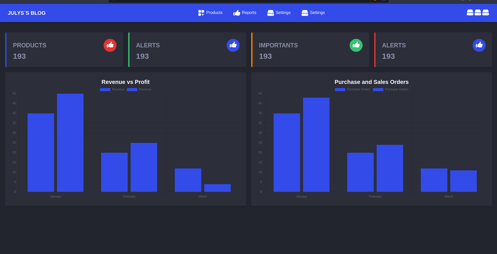
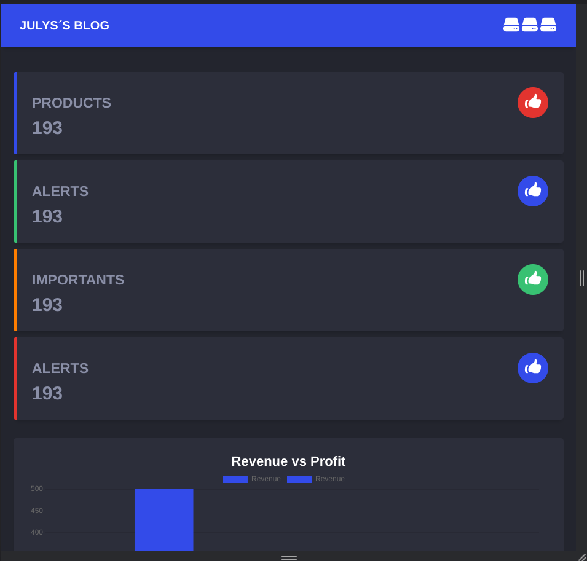

# DASHBOARD-ADMIN-VUEJS

This repository was made to train my knowledge in Vue JS by building a dashboard with some Vue properties such as :data :class and others

## Links 
- [Project 1 hagman](https://github.com/julysNICK/hangman_mobile_flutter)
- [Project 2 guessing game](https://github.com/julysNICK/guessing_game)

## Screenshots

You can find some screenshots of my UI projects below:





## Getting Started

To run the app, you'll need to have Flutter installed. Then, clone this repository, and run vuejs run in the project directory

## Contact
If you have any questions or feedback, feel free to contact me at julysmartins54@gmail.com.
## Project Setup

```sh
npm install
```

### Compile and Hot-Reload for Development

```sh
npm run dev
```

### Type-Check, Compile and Minify for Production

```sh
npm run build
```
